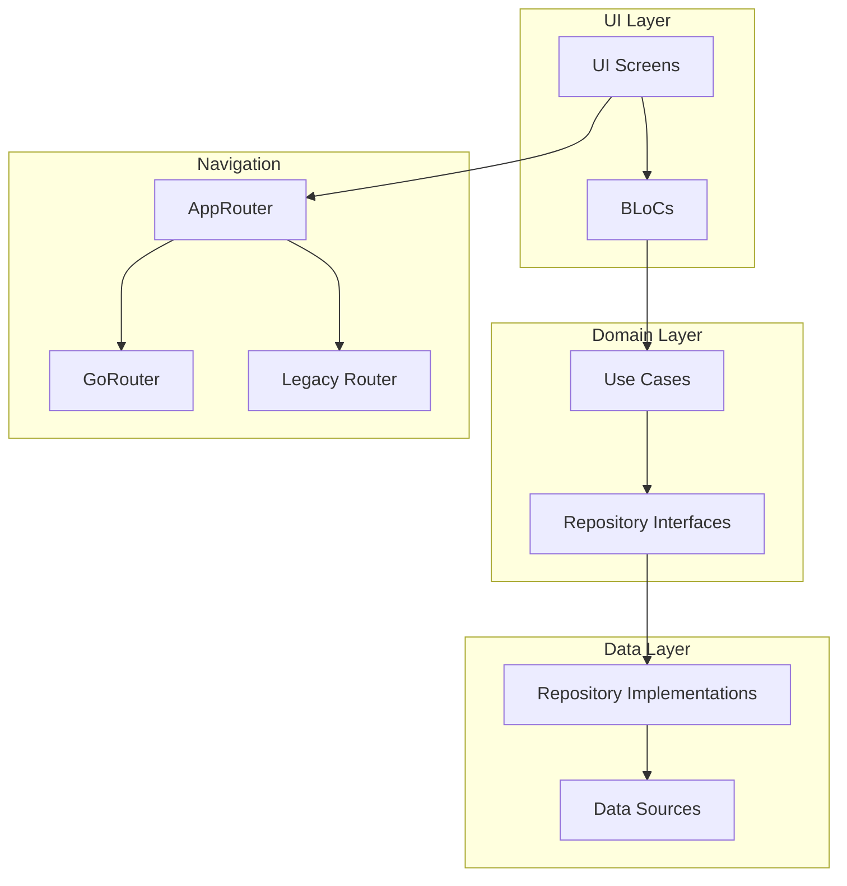
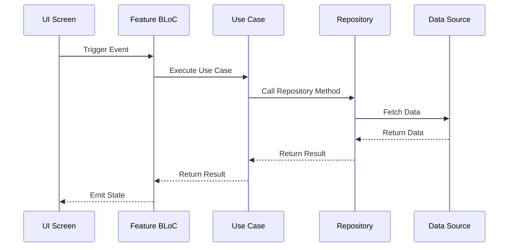
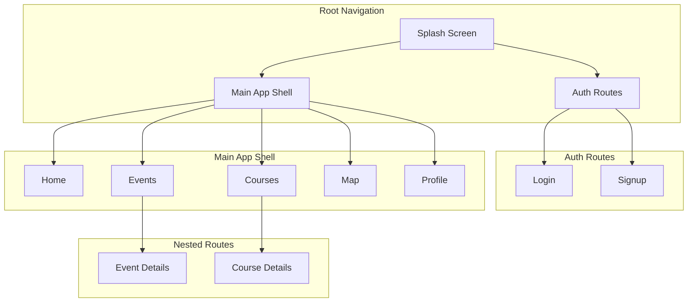

# Component Relationships

## Core Architecture

```mermaid
graph TD
    subgraph UI Layer
        A[UI Screens] --> B[BLoCs]
    end

    subgraph Domain Layer
        B --> C[Use Cases]
        C --> D[Repository Interfaces]
    end

    subgraph Data Layer
        D --> E[Repository Implementations]
        E --> F[Data Sources]
    end

    subgraph Navigation
        G[AppRouter] --> H[GoRouter]
        G --> I[Legacy Router]
    end

    A --> G
```

## Feature Implementation Flow

```mermaid
sequenceDiagram
    participant UI as UI Screen
    participant BLoC as Feature BLoC
    participant UC as Use Case
    participant Repo as Repository
    participant DS as Data Source

    UI->>BLoC: Trigger Event
    BLoC->>UC: Execute Use Case
    UC->>Repo: Call Repository Method
    Repo->>DS: Fetch Data
    DS-->>Repo: Return Data
    Repo-->>UC: Return Result
    UC-->>BLoC: Return Result
    BLoC-->>UI: Emit State
```

## Navigation Structure

```mermaid
graph TD
    subgraph Root Navigation
        A[Splash Screen] --> B[Auth Routes]
        A --> C[Main App Shell]
    end

    subgraph Auth Routes
        B --> D[Login]
        B --> E[Signup]
    end

    subgraph Main App Shell
        C --> F[Home]
        C --> G[Events]
        C --> H[Courses]
        C --> I[Map]
        C --> J[Profile]
    end

    subgraph Nested Routes
        G --> K[Event Details]
        H --> L[Course Details]
    end
``` 